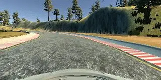
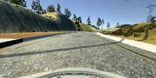
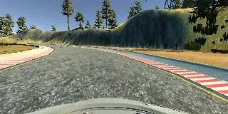
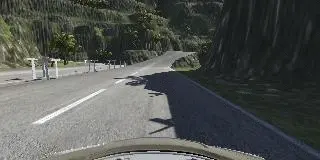

# Behavioral Datasets

Behavioral Cloning Project - Datasets

## Dataset one

### Clockwise Centar Lane Driving (track one)

* Three laps of center lane driving
* 

## Dataset two

### Counter Clockwise Centar Lane Driving (track one)

* Three laps of center lane driving
* 

## Dataset three

### Recovery Driving (track one)

* One lap of driving to left|right side than quick recover to center
* 

## Dataset four

### Driving smoothly around curves (track two)

* One lap of "smooth" driving
* 

## Create Merged Result

Create directories

```sh
mkdir -p all/IMG
```

Merge log files

```sh
cat data_1/driving_log.csv data_2/driving_log.csv data_3/driving_log.csv data_4/driving_log.csv > all/driving_log.csv
```

Merge images

```sh
cp data_1/IMG/* data_2/IMG/* data_3/IMG/* data_4/IMG/* all/IMG/
```
